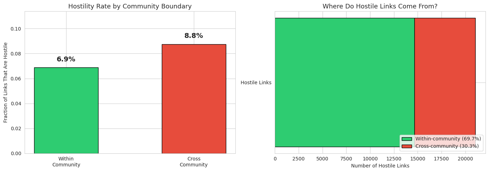
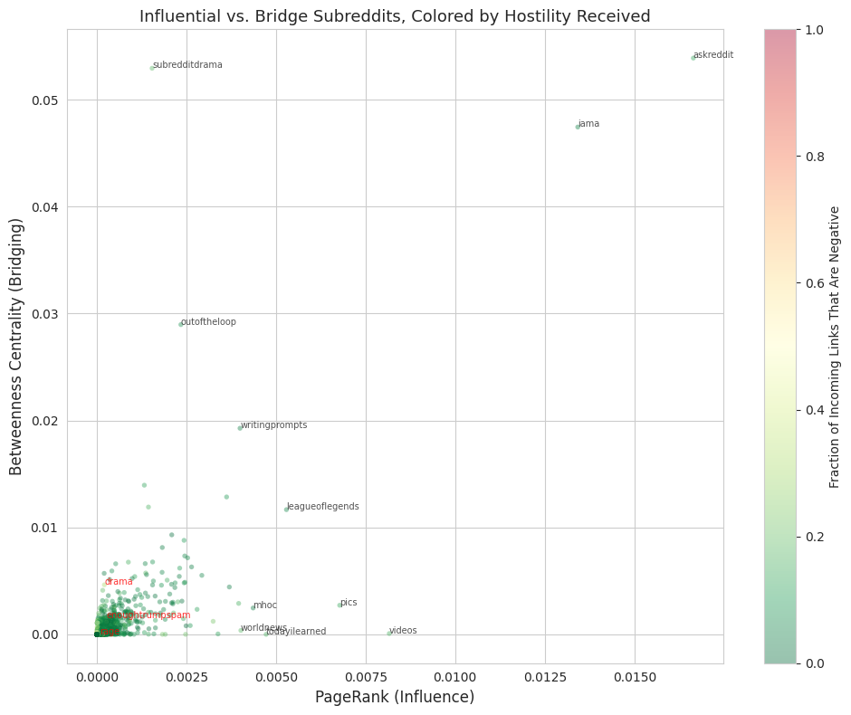
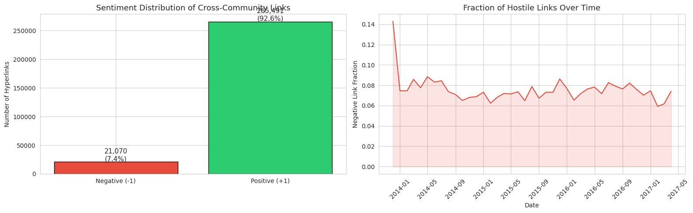
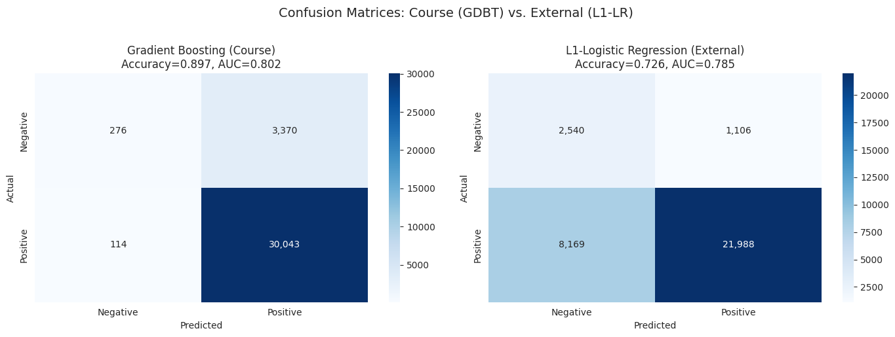
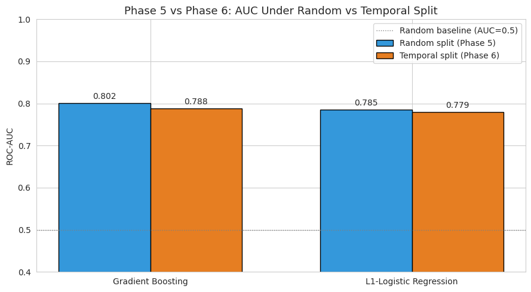
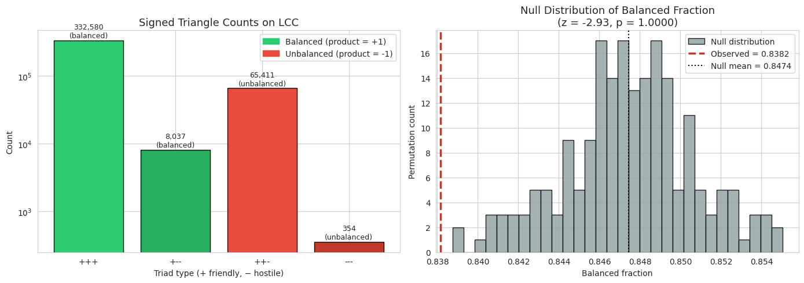

# What Drives Conflict Between Reddit Communities?

Author: Keshav Kapur (UIN: 237007751)

## Main Deliverable

Start here: `main_notebook.ipynb`

## Project Video

[Watch the project video](https://youtu.be/nEsfS9ury3U)

Checkpoint progression notebooks:
- `checkpoints/237007751_checkpoint1.ipynb`
- `checkpoints/237007751_checkpoint2.ipynb`

## Plots and Assets

- Keep exported figures from `main_notebook.ipynb` in `assets/`.

## Project Overview

This CSCE 676 Data Mining project analyzes the SNAP Reddit Hyperlink Network to study inter-community conflict. The central theme is whether hostile cross-subreddit links can be predicted, and which factors are most informative: network structure, language features, or both.

The final notebook includes conflict-focused exploratory analysis, graph mining, association rule mining, and supervised learning with network plus LIWC-derived text features.

## Research Questions

1. How does subreddit network structure relate to hostile cross-community interactions?
2. Which subreddit pairs are frequently co-targeted in hostile contexts, and what conflict corridors emerge?
3. How accurately can hostile links be predicted using graph and linguistic features?

## Data and Preprocessing

Dataset source:
- [SNAP: Reddit Hyperlink Network](https://snap.stanford.edu/data/soc-RedditHyperlinks.html)

Primary files used:
- [soc-redditHyperlinks-body.tsv](https://snap.stanford.edu/data/soc-redditHyperlinks-body.tsv)
- [soc-redditHyperlinks-title.tsv](https://snap.stanford.edu/data/soc-redditHyperlinks-title.tsv)

Preprocessing in the notebook:
- Load raw TSV files
- Parse LIWC attributes from `PROPERTIES`
- Parse timestamps and sentiment labels
- Aggregate multi-edges into a directed graph representation
- Build analysis/modeling features from graph and language signals

If raw files are not already in `data/`, the notebook workflow creates the folder and downloads needed files.
The repository keeps `data/.gitkeep` so the directory is tracked even when large dataset files are not committed.

## Reproducibility

This project was developed in Colab-style notebook workflows and is runnable locally with Jupyter.

1. Install dependencies:

```bash
pip install -r requirements.txt
```

2. Run the final deliverable notebook:

```bash
jupyter notebook main_notebook.ipynb
```

3. Optional progression review:
- Open `checkpoints/237007751_checkpoint1.ipynb` first
- Then `checkpoints/237007751_checkpoint2.ipynb`
- Then `main_notebook.ipynb` (submission notebook copy)

## Key Dependencies and Versions

Python:
- `Python 3.12.13`

Core packages (full pinned environment lives in `requirements.txt`):
- `pandas==2.2.2`
- `numpy==2.0.2`
- `matplotlib==3.10.0`
- `seaborn==0.13.2`
- `scikit-learn==1.6.1`
- `mlxtend==0.23.4`
- `urllib3==2.5.0`
- `networkx==3.6.1`
- `scipy==1.16.3`

## Repository Structure

```text
Data-Mining-Project/
├── checkpoints/
│   ├── 237007751_checkpoint1.ipynb
│   └── 237007751_checkpoint2.ipynb
├── main_notebook.ipynb
├── requirements.txt
├── README.md
├── assets/
│   └── .gitkeep
├── data/
│   └── .gitkeep
└── .gitignore
```

## Key Results (from notebook outputs)

- **Boundary effect (plot + counts):** Cross-community links are more hostile than within-community links (**8.8%** vs **6.9%**), even though within-community links are more common overall.
- **Conflict corridors (association-rule outputs):** Hostile mining yields **6,489** rules vs **241** positive-link rules; overlap analysis shows **607 conflict-only**, **16 friendly-only**, and **90 shared** corridors.
- **Prediction quality (model output + confusion plots):** Phase 5 ROC-AUC is **0.8015** (GDBT) and **0.7854** (L1-LR). GDBT ranks better overall, while L1-LR captures more hostile links (negative-class recall **0.70** vs **0.08**).
- **What drives conflict (feature-importance plots):** GBM importance is **59.0% structural** vs **41.0% linguistic**; top feature is `tgt_neg_incoming_frac` (**0.3869**).
- **Temporal robustness (Phase 6):** AUC drops are small under forward-in-time evaluation: GDBT **-0.0137**, L1-LR **-0.0062**.
- **Signed-network extension (Phase 7):** On 406,382 triangles, observed balanced fraction is **0.8382** vs null mean **0.8474** (**z = -2.93**), indicating structure but less balance than chance under this null.

### Result Plots by Research Question

- **RQ1 (structure vs hostility):**  
  Cross- vs within-community hostility  
    
  Centrality-position structure  
  

- **RQ2 (conflict corridors):**  
  Conflict intensity context (hostility landscape used before corridor mining)  
  

- **RQ3 (prediction and drivers):**  
  Model error profile comparison  
    
  Temporal robustness of predictive performance  
  

- **Extended analysis (beyond RQ1-RQ3):**  
  Signed-network structural balance test  
  

## Per-RQ Answers

1. **RQ1 (structure vs hostility):** **Yes.** Community boundaries matter: cross-community hostility rate is higher (**8.8% vs 6.9%**). PageRank and betweenness are related (**rho = 0.611**) but capture distinct structural roles.
2. **RQ2 (conflict corridors):** **Yes, strongly.** Hostile co-targeting is highly structured and far richer than friendly co-targeting (**6,489** hostile rules; **607** conflict-only corridors).
3. **RQ3 (predictability and drivers):** **Yes.** Hostile links are predictably classifiable (AUC around **0.78-0.80**), with a consistent edge for structural features over linguistic features (**59% vs 41%** importance).
